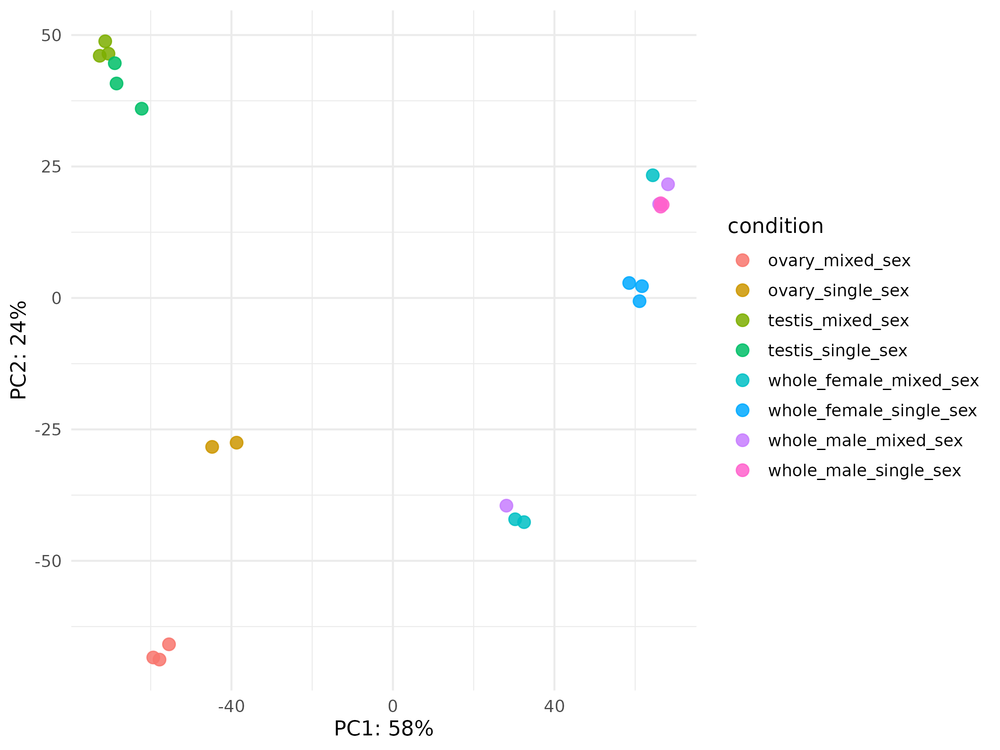
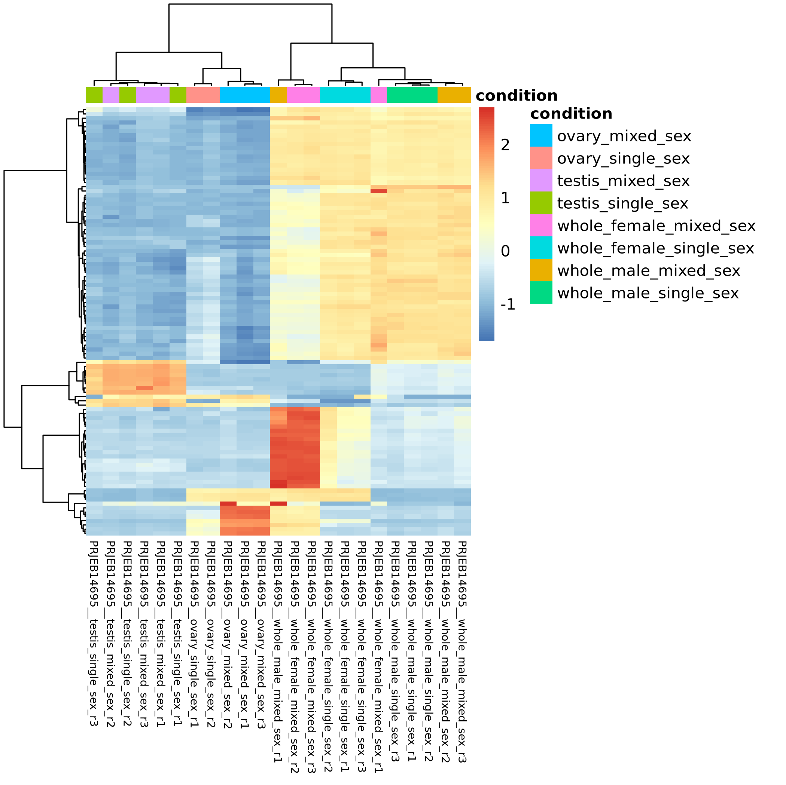

# PRJEB14695 execution report

## Executive summary

The authorized native RNA-seq path completed for 138 paired-end technical runs
representing 23 biological samples. Run-to-sample mapping and technical-run
aggregation were treated as scientific gates before tximport and DESeq2. QC,
Trim Galore, Salmon 1.10.3, import, the six frozen differential-expression
contrasts, figures, HTML reports, and the terminal RNA-seq manifest completed.

The analysis is classified as `PASS_WITH_LIMITATIONS`. The initial execution
stopped at Import sample-table validation because the run-level
`technical_unit` field was incorrectly treated as a biological invariant. The
reviewed HelixForge correction preserved biological-conflict detection while
accepting valid run-specific identifiers. A controlled resume then reused all
815 eligible upstream tasks and completed only the 12 pending downstream tasks.
No scientific parameter, contrast, sample, reference, or threshold was changed.

## Dataset and aggregation

- Study: `PRJEB14695`
- Technical runs: 138
- Biological samples: 23
- Technical runs per biological sample: 6
- Layout: paired-end
- FASTQ files: 276
- Compressed FASTQ input: 89,131,626,404 bytes
- Run-to-sample mapping: PASS
- Technical-run aggregation before inference: PASS

The 138 runs were not modeled as independent biological replicates. Their
registered mapping produced the 23 sample-level observations used by tximport
and DESeq2, avoiding pseudoreplication.

## Scientific design

- Formula: `~ condition`
- Frozen factor: `condition`
- Covariates: none
- Interaction: none
- Test: Wald
- Alpha: 0.05
- Absolute log2 fold-change threshold: 1.0
- Design matrix: full rank; all six requested contrasts estimable

## Reference and software

- Organism: *Schistosoma mansoni*
- Assembly: `SM_V10`
- Annotation: `WBPS19`
- Reference ID: `Schistosoma_mansoni_SM_V10_WBPS19`
- Shared Salmon k=31 index: reused and validated
- HelixForge base release: `v1.0.1`
- HelixForge execution commit: `42864266892d1165477bb3b33c919e1fabb28ad1`
- Nextflow: `25.10.7`
- Java: `21`

## Acquisition and integrity

All 276 expected FASTQs were present. Official checksums, locally recorded
SHA-256 values, gzip integrity, pairing, duplicate-name checks, and orphan
checks passed. No unexpected FASTQ was admitted.

## Quality control and quantification

- FastQC HTML reports generated during execution: 598
- MultiQC: PASS
- Salmon samples: 23
- Salmon targets per sample: 10,913
- Salmon mapping range: 39.19%–85.67%
- Mean Salmon mapping: 71.07%
- Salmon version: 1.10.3

The public result bundle retains the consolidated MultiQC HTML report but not
the 598 individual FastQC HTML files.

## Expression import

- Gene count matrix: 9,914 genes × 23 samples
- Abundance matrix: 9,914 genes × 23 samples
- Effective-length matrix: 9,914 genes × 23 samples
- `countsFromAbundance`: `lengthScaledTPM`
- `ignoreTxVersion=TRUE`
- `ignoreAfterBar=TRUE`
- Sum of imported counts: 498,080,683.755

## Differential expression

Each contrast tested 9,517 genes:

| Contrast | Significant genes |
|---|---:|
| Ovary mixed-sex vs ovary single-sex | 2,777 |
| Testis mixed-sex vs testis single-sex | 33 |
| Whole female mixed-sex vs whole female single-sex | 1,019 |
| Whole male mixed-sex vs whole male single-sex | 214 |
| Whole female mixed-sex vs whole male mixed-sex | 3 |
| Whole female single-sex vs whole male single-sex | 587 |

Positive log2 fold-change denotes higher expression in the numerator. These
counts describe the frozen statistical analysis and were not used to tune its
design or thresholds.





The six corresponding volcano plots are retained beside this report.

## Operational execution in Slurm

The controlled resume completed in 19m51s. It marked 815 eligible tasks as
`CACHED`, completed 12 pending tasks, and reported zero failures. This validates
cache reuse for the corrected launcher and work directory in the production
environment. It demonstrates operational feasibility in Slurm; it is not a
hardware scaling benchmark.

The largest observed task RSS was approximately 1.40 GiB. Salmon reached
approximately 1.10 GiB, and DESeq2 contrast tasks approximately 1.20 GiB. Full
per-process counts, summed task times, maximum task times, and maximum observed
RSS are recorded in `performance.tsv`.

## Terminal manifest

The terminal RNA-seq manifest passed JSON Schema, semantic, and tracked-input
filesystem validation. It declares 23 transcript-abundance artifacts, one
gene-count matrix, one abundance matrix, one normalized-count matrix, six
differential-expression tables, and one aggregate DE summary. These portable
artifacts form the reviewed boundary for later integration.

## Reports and provenance

The accepted public bundle contains MultiQC and the Nextflow execution report,
timeline, and DAG. Server paths, usernames, job identifiers, FASTQs, work
directories, and other private operational details were removed. Detailed logs
and checksums are retained separately in the verified private audit archive
`helixforge-smansoni-PRJEB14695-2026-09-17.zip` (SHA-256
`74be44d2cf041d1849055fb9984c0b900aa8080f0ed8f1f0481b0400a9bc4a2f`).

## Limitations

- The initial Import validation failure was a software-contract defect, not a
  failure of the biological design or generated data. It was corrected and
  regression-tested in HelixForge PR 88 before the successful resume.
- Candidate-gene reporting was not executed because no candidate list was
  preregistered for this study.
- Mapping percentages vary across biological samples; they are reported, not
  hidden or used for post-hoc sample removal.

## Final classification

```text
DATA_ACQUISITION = PASS
FASTQ_INTEGRITY = PASS
REFERENCE_INTEGRITY = PASS
SALMON_INDEX_REUSE = PASS
RUN_TO_SAMPLE_MAPPING = PASS
TECHNICAL_RUN_AGGREGATION = PASS
STATISTICAL_DESIGN = PASS
TECHNICAL_EXECUTION = PASS_WITH_LIMITATIONS
RESUME_CACHE_REUSE = PASS
QC = PASS
QUANTIFICATION = PASS
EXPRESSION_IMPORT = PASS
DIFFERENTIAL_EXPRESSION = PASS
TERMINAL_MANIFEST = PASS
HTML_REPORTS = PASS
PUBLIC_SANITIZATION = PASS

PRJEB14695_RNASEQ_ANALYSIS = PASS_WITH_LIMITATIONS
```

READY_FOR_PRJEB14695_REVIEW
