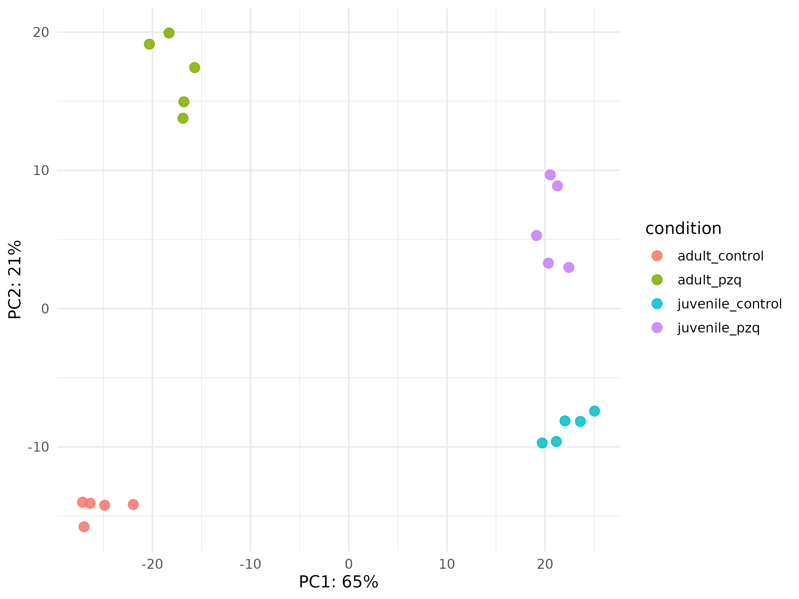
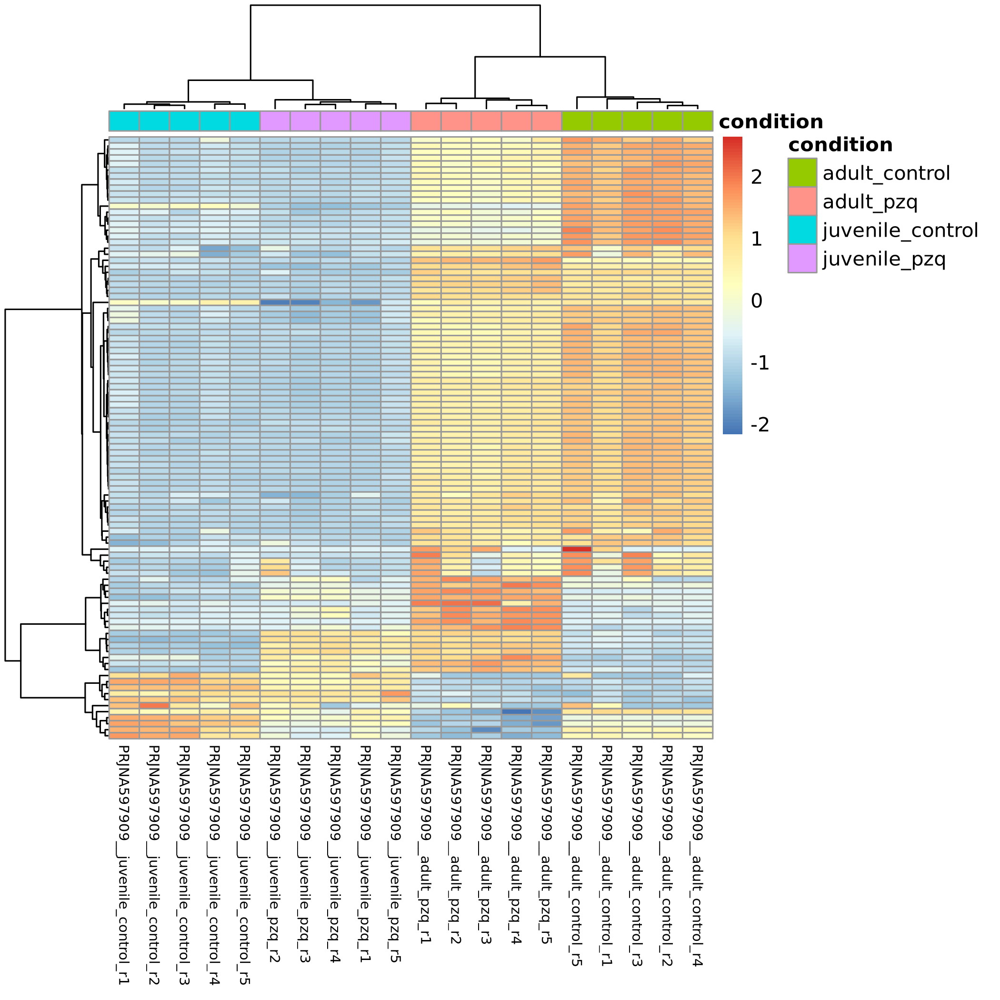

# PRJNA597909 execution report

## Executive Summary

The authorized native RNA-seq path completed for all 20 paired-end samples: QC, Trim Galore, Salmon 1.10.3, tximport, DESeq2, figures, and the terminal RNA-seq manifest. The four frozen Wald contrasts completed without changing the preregistered design or thresholds. The scientific result is accepted with operational limitations because the original terminal-manifest task lacked `jsonschema` in the selected host Python, and the controlled `-resume` attempt did not reuse eligible NFS cache entries. The manifest was recovered at the terminal boundary without recomputing QC, Salmon, Import, or DESeq2.

## Dataset

- Study: `PRJNA597909`
- Runs: 20
- Biological samples: 20
- Layout: paired-end
- Groups: adult control, adult praziquantel, juvenile control, juvenile praziquantel (5 replicates each)
- Compressed FASTQ input: 33,199,877,299 bytes

## Scientific Design

- Formula: `~ condition`
- Frozen factor: `condition`
- Covariates: none
- Interaction: none
- Test: Wald
- Alpha: 0.05
- Absolute log2 fold-change threshold: 1.0
- Design matrix: full rank; all requested contrasts estimable

## Reference

- Organism: *Schistosoma mansoni*
- Assembly: `SM_V10`
- Annotation: `WBPS19`
- Reference ID: `Schistosoma_mansoni_SM_V10_WBPS19`
- Shared Salmon k=31 index: reused and validated; no index build was requested

## Acquisition

- Expected/observed FASTQs: 40/40
- Download elapsed time: 25m39s
- MD5, SHA-256, gzip integrity, pairing, duplicate filenames, and orphan checks: PASS

## FASTQ Integrity

All 20 R1/R2 pairs matched the frozen manifest. No missing, unexpected, duplicate, corrupt, or orphaned FASTQ was detected.

## Storage Preflight

- Projected peak: 219,322,432,886 bytes
- Projected safe requirement (25% margin): 274,153,041,108 bytes
- Approved project limit: 300 GiB
- Storage preflight: PASS

## Native Execution

- HelixForge: v1.0.1 (`e41d221657b8e0bf2700bccd547e15032ccac36f`)
- Nextflow: 25.10.7
- Java: 21.0.12
- Run: `elated_picasso`
- Session: `65c83d56-a15d-48d9-ae11-42422f2e5d12`
- Original wall time: 1h37m54s
- Original workflow tasks: 219 succeeded, 1 failed at the terminal manifest only
- Peak concurrent tasks: 5
- Largest observed task RSS: 1416.3 MiB

## Recovery Events

The original `RUN_MANIFEST` task failed because the Python selected from the host `PATH` did not provide `jsonschema>=4.23`. A single controlled `-resume` attempt was started after correcting runtime order, but NFS cache entries were not reused; it was stopped before any expensive stage repeated. The terminal `.command.sh` was then executed alone under Slurm with the already certified `rna-tools` Python, producing a schema-valid manifest. No scientific stage was recomputed. Two lightweight foundation jobs from the unsuitable resume attempt completed and two residual jobs were cancelled.

## QC

- Samples complete: 20/20
- FastQC records summarized by MultiQC: 120
- Trim retention: 100.00%–100.00%
- Salmon mapping: 85.78%–89.92% (mean 87.96%)
- Sample classifications: PASS=20, REVIEW=0, FAIL=0
- Outliers: no obvious within-group outlier in the frozen PCA and top-100 heatmap; no sample was removed





## Expression

- Salmon targets per sample: 10913–10913
- Imported genes: 9914
- Samples in count, TPM, and length matrices: 20
- `countsFromAbundance`: `lengthScaledTPM`
- `ignoreTxVersion=TRUE`; `ignoreAfterBar=TRUE`
- Normalized count matrix: produced

## Differential Expression

- `condition__juvenile_pzq_vs_juvenile_control` (juvenile_pzq / juvenile_control): 9457 tested, 8906 with adjusted p-value, 204 significant (107 up, 97 down).
- `condition__adult_pzq_vs_adult_control` (adult_pzq / adult_control): 9457 tested, 9452 with adjusted p-value, 636 significant (338 up, 298 down).
- `condition__adult_control_vs_juvenile_control` (adult_control / juvenile_control): 9457 tested, 9452 with adjusted p-value, 1131 significant (757 up, 374 down).
- `condition__adult_pzq_vs_juvenile_pzq` (adult_pzq / juvenile_pzq): 9457 tested, 9452 with adjusted p-value, 1075 significant (763 up, 312 down).

Positive log2 fold-change means higher expression in the numerator; negative means higher expression in the denominator. PCA separates all four frozen groups, and the heatmap clusters the five replicates of each group together. These are biological sanity checks, not post-hoc changes to the analysis.

## Biological Sanity Checks

The frozen PCA separates the four experimental groups, while each group's five
replicates remain close to one another. The top-100 heatmap independently
recovers the same group structure without an obvious within-group outlier. No
sample was removed and these inspections did not change the design, contrasts,
thresholds, or reference.

## Performance

Stage-level task counts, summed task time, maximum task time, and maximum observed RSS are recorded in `performance.tsv`. This demonstrates executability in Slurm; it is not a scaling benchmark across hardware or problem sizes.

## Scratch Calibration

- Compressed input: 33,199,877,299 bytes
- Clean completion footprint: 166,215,888,896 bytes
- Workdir at clean completion: 66,597,888,000 bytes
- Project multiplier: 5.007×
- Previous PRJNA602528 multiplier: 6.606×

The lower multiplier reflects a clean uninterrupted scientific path and a larger input denominator. Recovery overhead was small and is recorded separately; no heavy scientific recomputation completed.

## Terminal Manifest

`rnaseq_run_manifest.json` passed JSON Schema, semantic, and tracked-input filesystem validation. Its portable integration bundle contains the count matrix, TPM matrix, normalized counts, four contrast tables, and the aggregate differential-expression table.

## Provenance

The frozen reference checksums, FASTQ checksums, commands, Nextflow session metadata, module versions, result checksums, performance reconstruction, and recovery events are retained in the private audit archive. Public records omit server paths, job identifiers, capacity data, and private operational limits.

## Persistence

- Accepted results: `$HF_RESULTS_ROOT/PRJNA597909`
- Portable terminal manifest: `../rnaseq/rnaseq_run_manifest.json`
- Private audit archive: `helixforge-smansoni-PRJNA597909-2026-09-16.zip`
- Private audit SHA-256: `1b99eea6143e9a493bdf3af88ab7ed878ce9f37f1e43636934d7b5694f4e4dd1`

The archive passed ZIP integrity checks, contains a Portuguese README, and does
not contain FASTQs or a Nextflow work directory.

## Limitations

- The original Nextflow trace/report was overwritten by the controlled resume attempt; performance was reconstructed from frozen `.command.run` and `.command.trace` records and the original rotated Nextflow log.
- The host runtime selection for `RUN_MANIFEST` required a terminal-only recovery. The corrected runtime order is retained for future clean runs.
- NFS `-resume` remains an operational limitation; it did not affect scientific outputs.
- No biological sample was excluded, and no threshold, design, contrast, or reference was changed after observing results.

## Cleanup

- Raw, trimmed FASTQs, workdir, and temporary study outputs removed: YES
- Space recovered: 166,370,873,344 bytes
- Project scratch residual: 0 bytes
- Shared SM_V10/WBPS19 reference, Salmon index, NXF_HOME, and NXF_CACHE_DIR preserved: YES

## Final Classification

```text
DATA_ACQUISITION = PASS
FASTQ_INTEGRITY = PASS
REFERENCE_INTEGRITY = PASS
SALMON_INDEX_REUSE = PASS
STORAGE_PREFLIGHT = PASS
METADATA_VALIDATION = PASS
STATISTICAL_DESIGN = PASS
REPORT_CONTRACT_PREFLIGHT = PASS
TECHNICAL_EXECUTION = PASS_WITH_LIMITATIONS
QC = PASS
EXPRESSION_IMPORT = PASS
DIFFERENTIAL_EXPRESSION = PASS
TERMINAL_MANIFEST = PASS
PROVENANCE = PASS
SCRATCH_CALIBRATION = PASS
PERSISTENT_COPY = PASS
AUDIT_PACKAGE = PASS
CLEANUP = PASS

RESUME_REQUIRED = YES
REENTRY_REQUIRED = YES

PRJNA597909_RNASEQ_ANALYSIS = PASS_WITH_LIMITATIONS
```

READY_FOR_PRJNA597909_REVIEW
