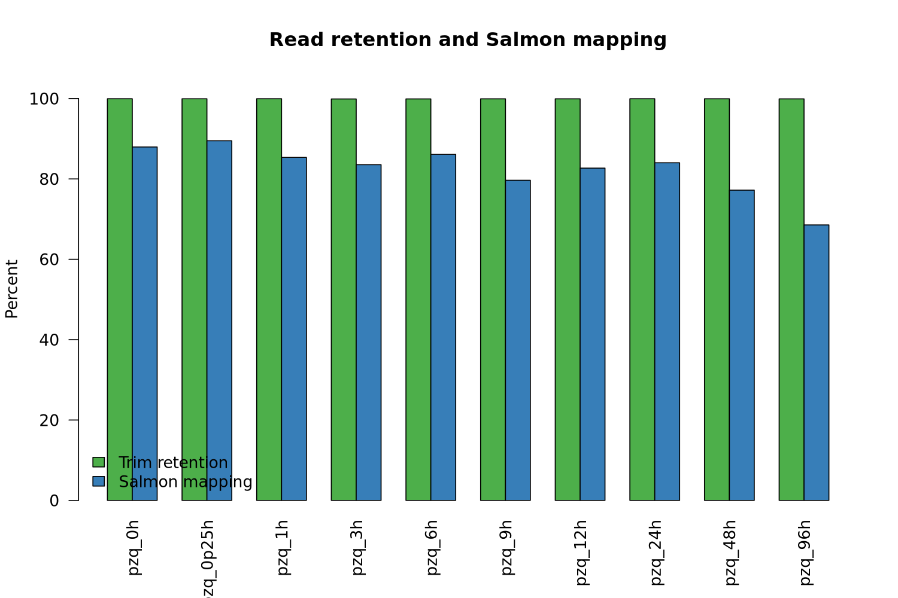
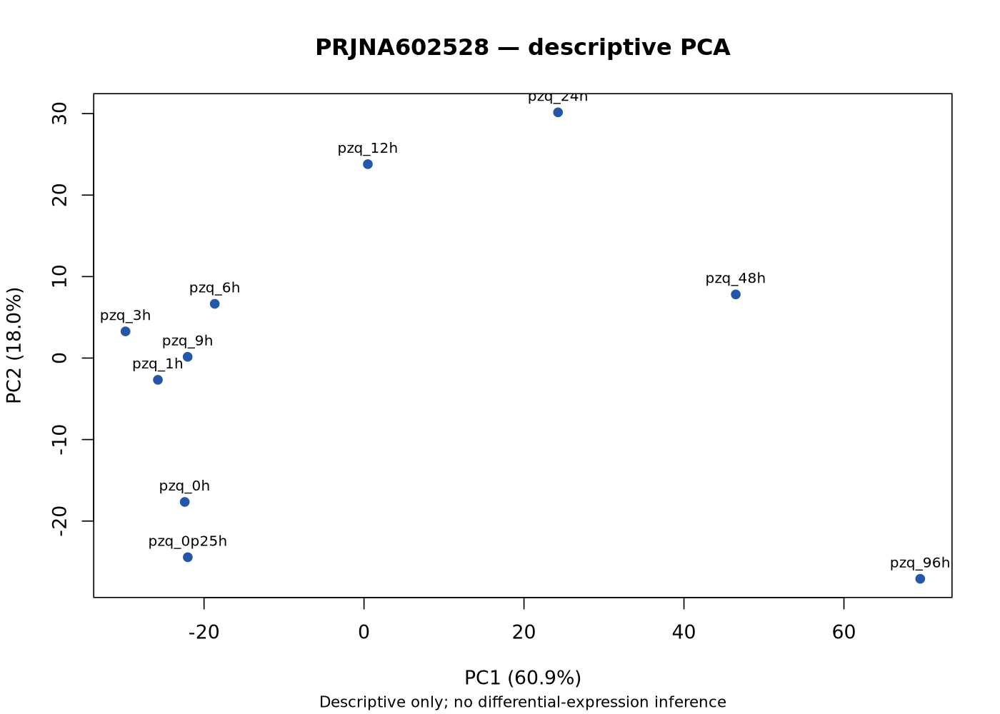
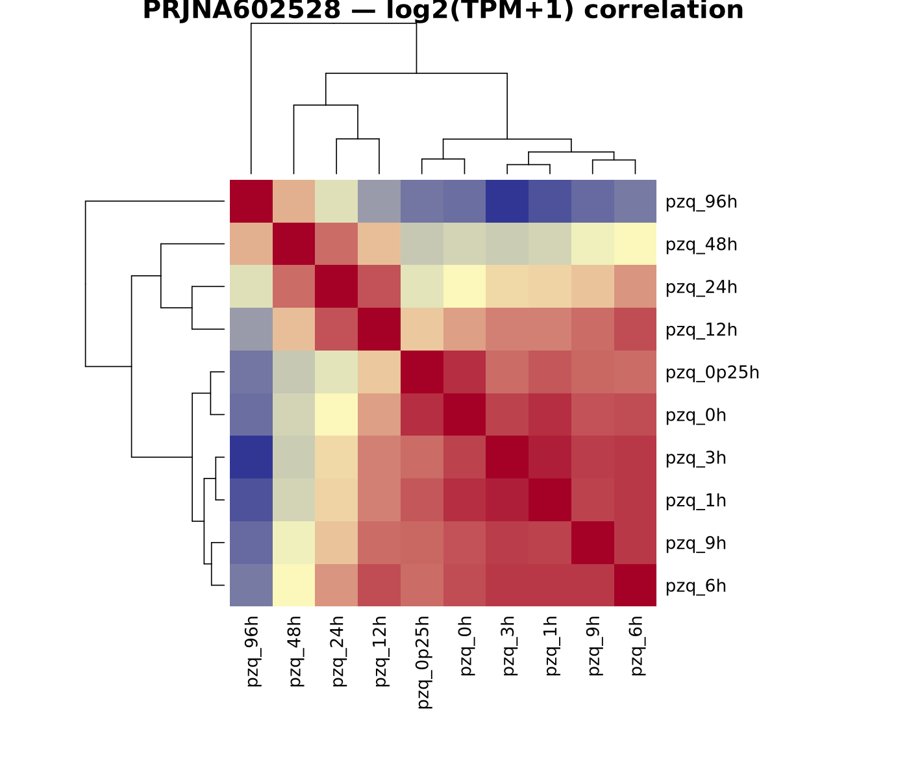
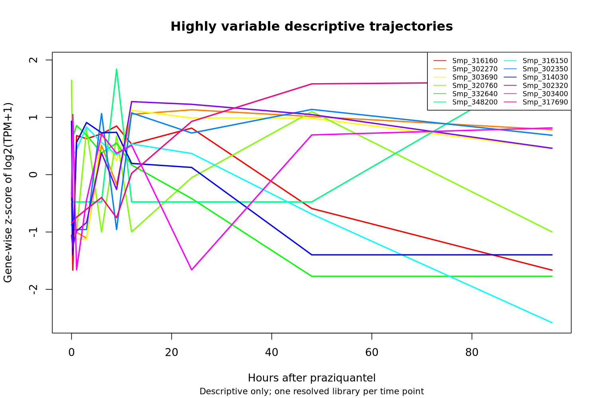

# PRJNA602528 execution report

## Executive Summary

The first real HelixForge-SMansoni project completed the authorized `IMPORT_ONLY` path for 10 paired-end RNA-seq samples. QC, trimming, Salmon 1.10.3 quantification, tximport aggregation, persistent result publication, and terminal-manifest validation passed.

`DIFFERENTIAL_EXPRESSION = NOT_PERFORMED_BY_DESIGN`

DE was intentionally disabled by the project-specific scientific contract. The publicly resolved replication structure does not support the frozen differential-expression design.

## Dataset

- Study: PRJNA602528
- Runs: 10
- Samples: 10
- FASTQs: 20 paired files
- Compressed input: 17,455,857,588 bytes
- Organism: *Schistosoma mansoni*
- Biological context: descriptive praziquantel time course

## Scientific Contract

- Mode: `IMPORT_ONLY`
- Quantification: Salmon
- Import: tximport with `countsFromAbundance=lengthScaledTPM`
- Inferential DESeq2: `NOT_APPLICABLE`
- All temporal plots are descriptive; no p-values, FDR, or DEG calls were produced.

## Reference

- Assembly: SM_V10
- Annotation: WBPS19
- Reference ID: `Schistosoma_mansoni_SM_V10_WBPS19`
- Existing Salmon k=31 index validated and reused; it was not reconstructed.

## Data Acquisition and FASTQ Validation

- Download job: 19300 (maximum five concurrent tasks)
- Integrity job: 19310
- Download duration: 2,623 seconds
- Official MD5: 20/20 PASS
- gzip integrity: PASS
- R1/R2 pairing: PASS

## HelixForge Execution

- HelixForge: v1.0.1 (e41d221657b8e0bf2700bccd547e15032ccac36f)
- Nextflow: 25.10.7
- Java: 21
- Profile: Slurm
- Post-QC run: `determined_rutherford`
- Session UUID: `c871a46c-003b-4265-9b5d-fd7b263cda57`
- Post-QC tasks: 30 succeeded, 0 failed
- Post-QC wall time: 5m04s
- Largest post-QC task RSS: 858.4 MB (`RNASEQ_ALIGNMENT_QUANTIFICATION:QUANTIFICATION:SALMON_QUANT (PRJNA602528.pzq_12h.quantification)`)

The complete QC products from the first run were reused through a controlled post-QC re-entry. Nextflow `-resume` on the shared NFS did not reuse eligible task-cache entries and is recorded as an operational limitation, not a scientific failure.

## QC

- Samples complete: 10/10
- FastQC records: 60/60
- MultiQC: PASS
- Trim retention range: 99.90%–99.95%
- Salmon mapping range: 68.55%–89.50%
- Samples flagged below 70% Salmon mapping: 1



## Expression Import

- Transcripts quantified per sample: 10,913
- Genes imported: 9,914
- Count matrix: PASS (10 samples)
- TPM matrix: PASS (10 samples)
- Length matrix: PASS (10 samples)
- Summed imported counts: 189570288.954

## Descriptive Temporal Overview

These figures are descriptive only and do not represent differential-expression inference.







## Performance and Scratch Calibration

- Completion-checkpoint scratch: 115,315,521,194 bytes
- Compressed input: 17,455,857,588 bytes
- Observed conservative multiplier: 6.606×
- Provisional prior ceiling: 10.56×
- Warning threshold crossed: TRUE
- Stop threshold crossed: FALSE

The checkpoint includes recoverable work from interrupted resume attempts and is therefore a conservative operational upper bound, not a scaling benchmark.

## Terminal Manifest and Provenance

- Terminal manifest: `../manifests/rnaseq_run_manifest.json`
- JSON Schema: PASS
- Semantic validation: PASS
- Filesystem/checksum validation: PASS
- Quantification source manifests: 10
- Import source manifest: 1

## Limitations

- The public design contains one resolved library per time point and does not authorize inferential DE.
- Nextflow task-cache reuse was unreliable on the shared NFS; a controlled post-QC re-entry completed the intended native Salmon and Import layers.
- Scratch was measured at frozen checkpoints, not continuously; the completion value is conservative because it includes interrupted-attempt work.
- Temporal visualizations are descriptive and must not be interpreted as significance tests.

## Cleanup

- Cleanup job: 19519
- Scratch before cleanup: 97,859,705,391 bytes
- Scratch after cleanup: 0 bytes
- Space recovered: 97,859,705,391 bytes
- Raw FASTQs removed: YES
- Trimmed FASTQs removed: YES
- Nextflow workdirs removed: YES
- Shared SM_V10/WBPS19 reference preserved: YES
- Shared Salmon index preserved: YES
- Other projects touched: NO

## Final Classification

```text
DATA_ACQUISITION = PASS
FASTQ_INTEGRITY = PASS
REFERENCE_INTEGRITY = PASS
TECHNICAL_EXECUTION = PASS_WITH_LIMITATIONS
QC = PASS
EXPRESSION_IMPORT = PASS
DIFFERENTIAL_EXPRESSION = NOT_APPLICABLE
TERMINAL_MANIFEST = PASS
PROVENANCE = PASS
SCRATCH_CALIBRATION = PASS_WITH_LIMITATIONS
PERSISTENT_COPY = PASS
AUDIT_PACKAGE = PASS
CLEANUP = PASS

PRJNA602528_ANALYSIS = PASS_WITH_LIMITATIONS
```

READY_FOR_PRJNA602528_REVIEW
